# 差分信号过冲测试报告

**测试日期：2026年7月24日**

---

## 一、测试背景

客户的 FP、DM 信号使用了 10cm 的排线，信号上存在过冲超过 4V 的问题。需要评估该过冲对 MCU 是否有影响，以及是否可以通过串联电阻来解决问题。

---

## 二、测试条件

- **测试设备：** Tektronix 示波器（配 TPP0500B 探头）
- **测试位置：** 靠近主机测试点、经过 10cm FPC 后的模组测试点
- **测试信号：** DP、DM 差分信号
- **可调电阻：** R5、R8（位于 USB 差分信号路径上）
- **垂直刻度：** 2.00 V/div
- **耦合方式：** DC（直流耦合）
- **带宽设置：** 全带宽

### 测试环境照片

**图1：靠近主机端测试环境**

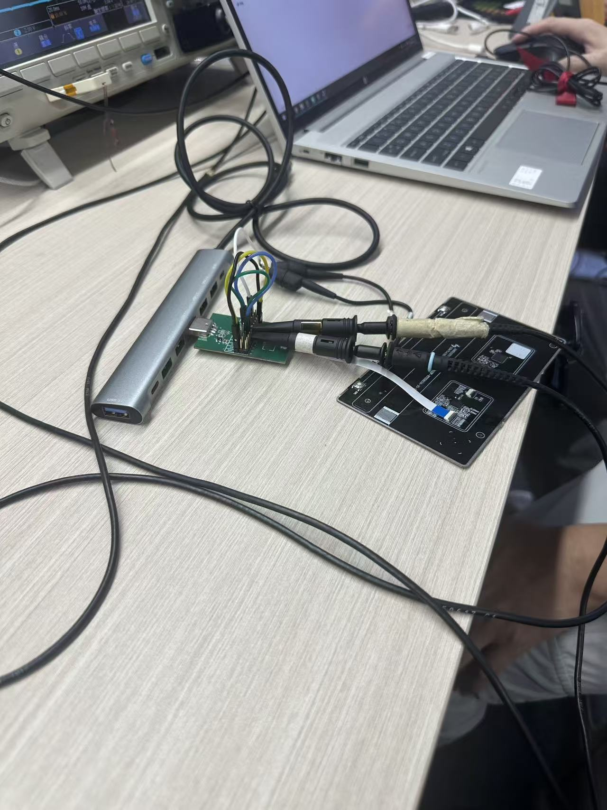

**图2：模组端测试环境**

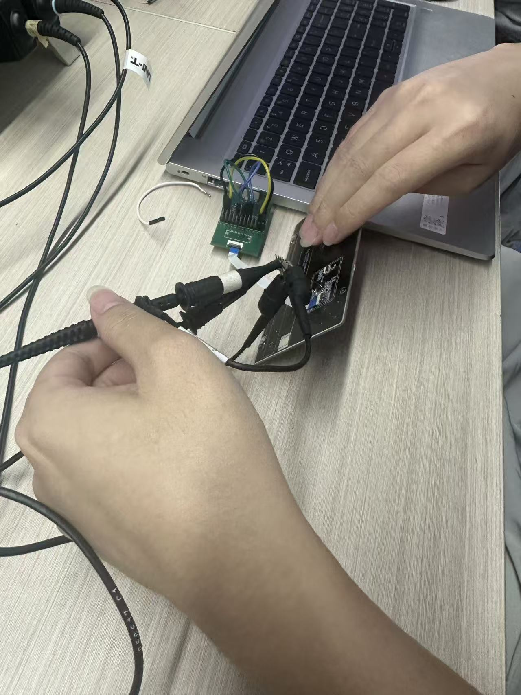

---

## 三、测试分组及结果

### 3.1 第一组：0Ω（原始状态）

R5、R8 保持原始 0Ω 电阻，分别测量靠近主机端的 DM 信号和模组端的 DP 信号。

| 测试点 | 信号 | 峰值电压 | 谷值电压 | 峰峰值 | 测试时间 |
|--------|------|----------|----------|--------|----------|
| 靠近主机 | DM | 3.840V | -200.0mV | 4.040V | 15:20:10 |
| 模组端 | DP | 3.520V | -320.0mV | 3.840V | 15:19:14 |

**图3：0Ω - 靠近主机端 DM 信号波形**

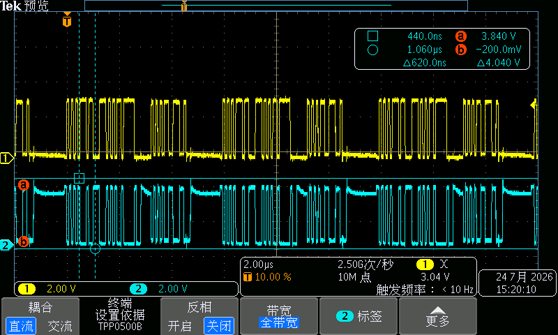

**图4：0Ω - 模组端 DP 信号波形**

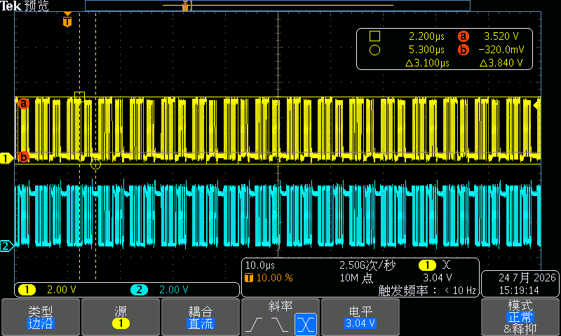

---

### 3.2 第二组：3.3Ω

将 R5、R8 替换为 3.3Ω 电阻，分别测量靠近主机端的 DP 信号和模组端的 DM 信号，每组进行两次测量。

| 测试点 | 信号 | 峰值电压 | 谷值电压 | 峰峰值 | 测试时间 |
|--------|------|----------|----------|--------|----------|
| 靠近主机 | DP | 3.680V | -360.0mV | 4.040V | 15:33:44 |
| 靠近主机 | DP | 3.840V | -280.0mV | 4.120V | 15:52:18 |
| 模组端 | DM | 3.560V | -440.0mV | 4.000V | 15:32:13 |
| 模组端 | DM | 3.600V | -360.0mV | 3.960V | 15:54:48 |

**图5：3.3Ω - 靠近主机端 DP 信号波形（第一次）**

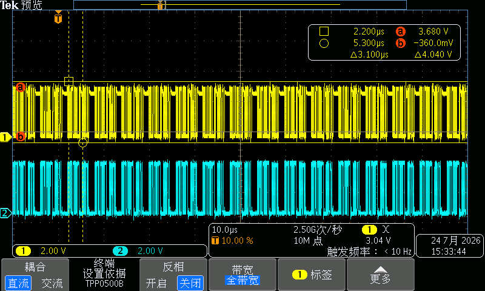

**图6：3.3Ω - 靠近主机端 DP 信号波形（第二次）**

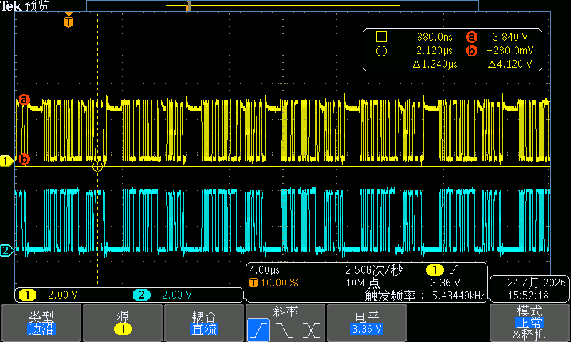

**图7：3.3Ω - 模组端 DM 信号波形（第一次）**

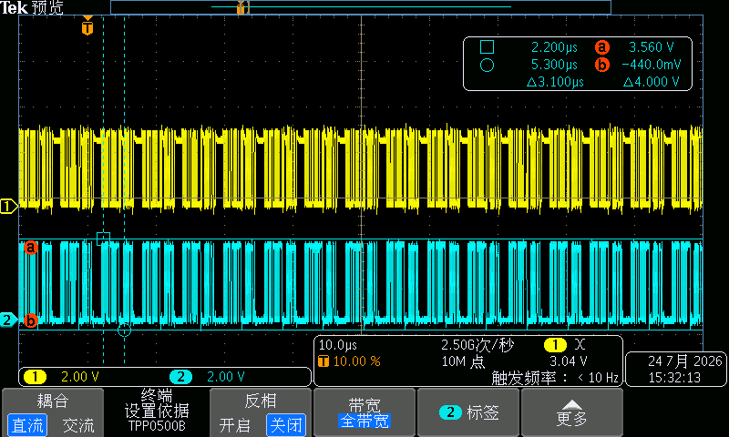

**图8：3.3Ω - 模组端 DM 信号波形（第二次）**

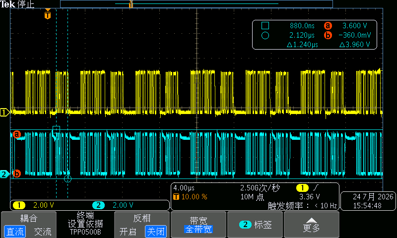

---

### 3.3 第三组：10Ω

将 R5、R8 替换为 10Ω 电阻，分别测量靠近主机端的 DP 信号和模组端的 DM 信号。

| 测试点 | 信号 | 峰值电压 | 谷值电压 | 峰峰值 | 测试时间 |
|--------|------|----------|----------|--------|----------|
| 靠近主机 | DP | 3.760V | -240.0mV | 4.000V | 16:46:51 |
| 模组端 | DM | 3.560V | -360.0mV | 3.920V | 16:49:00 |

**图9：10Ω - 靠近主机端 DP 信号波形**

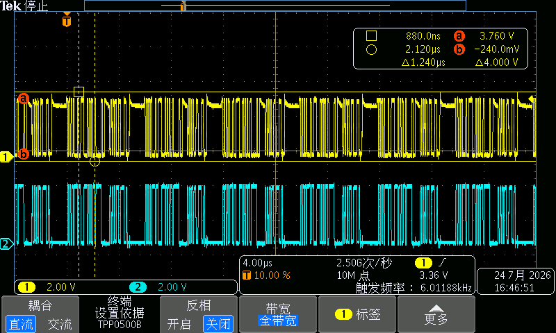

**图10：10Ω - 模组端 DM 信号波形**

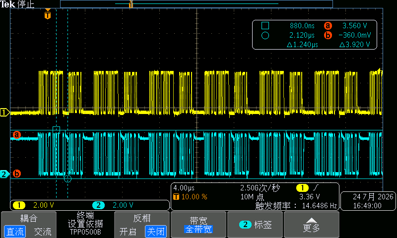

---

## 四、测试数据汇总

下表汇总了三组测试的所有测量数据，便于对比不同电阻值对信号过冲的影响。

| 电阻值 | 测试点 | 信号 | 峰值电压 | 谷值电压 | 峰峰值 |
|--------|--------|------|----------|----------|--------|
| 0Ω     | 靠近主机 | DM | 3.840V | -200.0mV | 4.040V |
| 0Ω     | 模组端   | DP | 3.520V | -320.0mV | 3.840V |
| 3.3Ω   | 靠近主机 | DP | 3.680V | -360.0mV | 4.040V |
| 3.3Ω   | 靠近主机 | DP | 3.840V | -280.0mV | 4.120V |
| 3.3Ω   | 模组端   | DM | 3.560V | -440.0mV | 4.000V |
| 3.3Ω   | 模组端   | DM | 3.600V | -360.0mV | 3.960V |
| 10Ω    | 靠近主机 | DP | 3.760V | -240.0mV | 4.000V |
| 10Ω    | 模组端   | DM | 3.560V | -360.0mV | 3.920V |

---

## 五、PCB 参考图

下图为 PCB 布局参考图，标注了 R5、R8 电阻的位置以及 USB 差分信号路径（USB+、USB-、DP、DN）。

**图11：PCB 布局 - R5 & R8 位置参考**

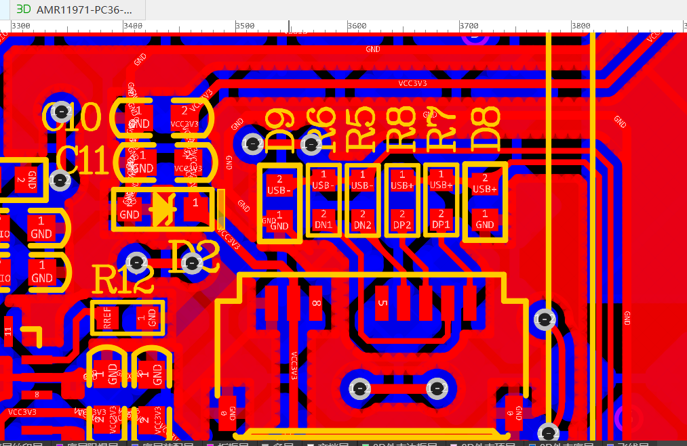

---

## 六、测试结论

- 更换 3.3Ω 电阻之后，信号过冲并无明显变化。
- 更换 10Ω 电阻后，过冲仍无太大改变。
- 综上所述，通过串联电阻（3.3Ω ～ 10Ω）的方式对差分信号过冲的改善效果不明显。
